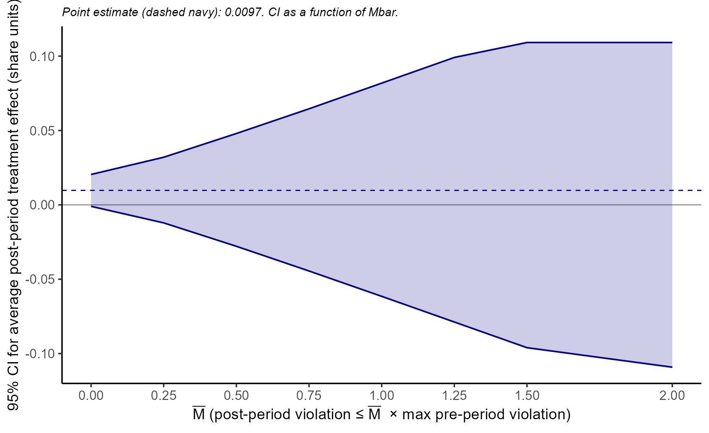

# Within-NACE-4d Intensive Margin: Findings

---

## Summary

We test whether the EU ETS / Market Stability Reserve (MSR) caused Belgian buyers to reallocate expenditure away from their most carbon-exposed supplier toward less-exposed alternatives, within the same NACE 4-digit input category.

Using a present-in-2010-14 sample and the Rambachan-Roth (2023) honest DiD framework, we find:

- The average post-2017 within-cell expenditure-share differential between most-exposed and least-exposed suppliers is **bounded in magnitude by ~5 percentage points** under reasonable parallel-trends assumptions, and by ~7-8 pp under aggressive assumptions.
- A within-NACE-4d substitution effect of 5+ pp in either direction is **rejected** by the data.
- Under exact parallel trends, the 95% CI for the average post-period effect is [−0.008, +0.009] on the raw event study and [−0.001, +0.015] on the age-detrended event study — both contain zero or are very close to it.

**The within-NACE-4d intensive margin response to the EU ETS / MSR is small.** Whatever buyers did in response to the policy, they did not substantially reallocate among regulated and unregulated suppliers within the same input category.

A structural CES estimation via Poisson PML gives a point estimate of σ ≈ 1.5–3 for a reasonable range of pass-through and EUA-price assumptions (slightly above Cobb-Douglas, consistent with modest substitutability), though the CI is too wide to pin σ down precisely. See [Structural CES](#structural-ces-estimating-the-elasticity-of-substitution) below.

---

## The empirical question

Carbon-leakage theory predicts that buyers facing a carbon price will substitute away from carbon-intensive suppliers toward less-exposed alternatives. Within a single input category (NACE 4-digit), this is the intensive margin of substitution: does the buyer give the regulated supplier a smaller share of its NACE-4d spend, holding the input category fixed?

The relevant comparison is **within-cell**: for each (buyer, NACE-4d) pair where the buyer sources from both a regulated and an unregulated supplier, what happens to the expenditure-share differential between them after the policy hits?

---

## Sample: "Present in 2010-14"

### Cell definition

A **cell** is a (buyer *b*, NACE-4d *n*) pair where the buyer sources from multiple suppliers in the same input category. A cell enters the sample if:

1. The buyer sourced from at least 2 distinct suppliers in *some* year of 2010-2014 (the pre-window).
2. The buyer sourced from at least one of those suppliers in *some* year of 2015-2016 (the omega-measurement window).
3. The cell's maximum 2015-16 ω is positive (at least one supplier is regulated).
4. The cell's minimum 2015-16 ω is strictly below the maximum (a real exposure contrast exists).

The dual-window requirement (pre AND omega-window activity) ensures that every supplier in the cell was a real candidate for substitution at the moment the MSR price hit. Pairs that died before 2015 are excluded because the buyer can't reallocate away from a dead supplier.

### Top vs. bot

Within each cell, we identify:

- **Top supplier**: the single supplier with the highest 2015-16 ω. ω is the firm's carbon shortage (emissions − free allocation) as a share of total cost. Top = most exposed to the carbon price in the omega-window.
- **Bot pool**: all suppliers in the cell tied at the *minimum* 2015-16 ω. In most cells this minimum is 0 (the pool consists of unregulated suppliers or regulated suppliers with surplus allocation); in a small fraction of cells (~5%) it is positive (all suppliers regulated). When multiple suppliers tie at the minimum ω, we compute the average of their expenditure shares — a "portfolio bot" rather than picking one supplier via a sales tiebreaker.

The bot portfolio approach was chosen over the single-bot definition (smallest ω, sales tiebreaker) because on a previous version of the sample roughly 32% of cells had multiple suppliers tied at ω = 0, and the sales tiebreaker systematically picked the smallest of those — biasing the bot toward fragile relationships.

### Sample size (RMD)

- 2017-treatment panel: **4,997 cells** with both top and bot trajectories observable.
- 2005-treatment panel: 1,790 cells (used for the EU ETS launch event, reported separately).
- For the 2017 panel, the bot pool averages 3.58 ω=0 suppliers per cell; 94.9% of cells have min ω = 0.

---

## Specification

### The headline DiD

We estimate, at the pair-year level (each top supplier and each bot-pool member contributes one observation per year):

```
share_{p,t} = α_{cell × role}  +  δ_year  +  γ · (post × top)  +  ε_{p,t}
```

clustered on cell, where:

- `share_{p,t}` = sales from pair *p*'s seller to the buyer / total buyer NACE-4d spend.
- `α_{cell × role}` is a cell-by-role fixed effect (absorbs time-invariant level differences).
- `δ_year` is a year fixed effect (absorbs aggregate year shocks).
- `post_t` = 1[year ≥ 2017].
- `top_p` = 1 if pair belongs to the top supplier; 0 if it's a bot-pool member.
- γ identifies the average post-2017 differential change in within-cell share between top and bot.

The panel covers calendar years 2010-2022. Pair-year observations enter the sample as soon as the buyer-seller pair is first observed (year `t_start(p)`, which lies in 2010-14 by construction).

### The event study

The corresponding event study replaces `post × top` with year-by-year interactions:

```
share_{p,t} = α_{cell × role}  +  δ_year
           +  Σ_{k ≠ −1} β_k · 1[year = 2017 + k] · top_p  +  ε_{p,t}
```

where *k* indexes years relative to 2017 (the omitted reference is *k* = −1, i.e. 2016). The β_k coefficients trace the year-by-year top-vs-bot differential, all measured relative to 2016. This is the diagnostic that lets us check parallel trends visually.

### The identification problem: pre-period violations

The raw event study (RMD) reveals a substantial structural pre-trend in the top-bot differential:

| Year | k | β_k (raw event study) |
|---|---|---|
| 2010 | −7 | **−0.064** |
| 2011 | −6 | −0.016 |
| 2012 | −5 | +0.009 |
| 2013 | −4 | +0.009 |
| 2014 | −3 | −0.009 |
| 2015 | −2 | −0.003 |
| 2016 | −1 | 0 (ref) |
| 2017 | 0 | −0.007 |
| 2018 | 1 | +0.014 |
| 2019 | 2 | +0.013 |
| 2020 | 3 | +0.018 |
| 2021 | 4 | +0.022 |
| 2022 | 5 | **+0.060** |

The pre-period coefficients rise from −0.064 in 2010 to ~0 in 2016 — a clear upward slope. The standard DiD assumption (parallel trends) requires these to be flat at zero. They are not.

We diagnosed this as **structural attrition asymmetry**: top-ω suppliers (large, capital-intensive ETS firms) have slightly higher survival rates than ω=0 suppliers (small, often non-ETS firms). Within-cell, this generates a pre-policy widening of the top-bot expenditure-share differential as the panel ages.

We tried two ad-hoc corrections:

1. **Linear pre-trend × top:** add `φ · (year - 2017) · top` to the regression. The pre-period gap is fitted with a linear slope, and γ on post × top captures the *break* at 2017 relative to that slope. RMD: γ = −0.0075 (SE 0.004, *p* < 0.10).

2. **Age × top fixed effects:** at the pair-year level, control for the age of each relationship (`age = year − t_start`) interacted with top status. This absorbs the age-dependent component of the top-bot differential. RMD: γ = −0.0019 (n.s.).

3. **Option 2A: Pre-policy baseline, restricted to ages 0-6.** Estimate `f_role(age)` from pre-policy data only, then run the DiD on `share − f_role(age)`. Drop ages 7+ (post-period-only). RMD: γ = +0.0258 (sig).

4. **Option 2B: Pre-policy baseline with geometric extrapolation.** Same as 2A but extrapolate `f_role(age)` to ages 7-12 using a log-linear fit on the pre-policy ages 0-6. RMD: γ = +0.0127 (sig).

These corrections give point estimates ranging from −0.008 (mild leakage) to +0.026 (mild anti-leakage). **The data does not pin down the sign**: different reasonable models of the structural pre-trend give different signs. This motivates the honest DiD framework.

---

## Methodology: Honest DiD

The Rambachan-Roth (2023, *Review of Economic Studies*) honest DiD framework asks: instead of choosing one model of the structural pre-trend and pretending we know it, **bound the post-period treatment effect under different assumptions about how badly parallel trends could fail in the post period**.

### The idea

Let *β_k* denote the year × top event-study coefficient at horizon *k*. In a perfect DiD world, parallel trends holds and the pre-period *β*'s would be zero: `β_{-7} = β_{-6} = ... = β_{-2} = 0`. Any deviation from zero in the pre-period is a "violation" of parallel trends.

Post-period *β*'s capture the treatment effect *plus* any continuation of the pre-period violation. We don't observe the violation directly in the post period; we have to assume something about it.

The relative-magnitudes (RM) restriction says:

> The largest post-period parallel-trends violation is at most *M-bar* times the largest pre-period violation.

Formally: |post-period violation in any year| ≤ M-bar · max |pre-period β_k|.

For each choice of *M-bar*, HonestDiD computes a confidence interval for the *target* treatment effect — in our case, the average post-period β. The CI is *robust* to any pre-trend violation consistent with the M-bar restriction.

### Interpreting M-bar

- **M-bar = 0:** assume exact parallel trends. The CI is the standard 95% CI on the average post-period β.
- **M-bar = 0.5:** allow the post-period violation to be at most half the worst pre-period violation. Relatively mild concession.
- **M-bar = 1:** allow the post-period violation to be as bad as the worst pre-period violation. The most natural "agnostic" benchmark.
- **M-bar = 2:** allow the post-period violation to be twice the worst pre-period violation. Aggressive.

For each M-bar, we report the CI. The **breakdown M-bar** is the smallest M-bar at which the CI includes a target value (e.g., zero, or a leakage threshold). A small breakdown M-bar means the null is fragile to pre-trend violations; a large one means it's robust.

### Why this is better than ad-hoc trend correction

Linear pre-trend correction, age × top control, and the pre-policy baseline are all *functional-form assumptions* about the structural trend. The data doesn't tell us which is correct; each is a modeling choice that gives a different γ.

HonestDiD doesn't ask us to pick. It bounds γ over a range of plausible pre-trend models indexed by M-bar, and reports the CI that's robust to any model in that class. The cost is wider CIs; the benefit is robustness to model uncertainty.

---

## Findings

### Raw event study + HonestDiD bounds (RMD)

The average post-period β across 2017-2022 (equal weights) is **+0.0007** — essentially zero.

| M-bar | 95% CI for avg post-period β |
|---|---|
| 0 (exact PT) | [−0.008, +0.009] |
| 0.25 | [−0.019, +0.020] |
| 0.50 | [−0.034, +0.035] |
| 0.75 | [−0.050, +0.051] |
| 1.00 | [−0.066, +0.067] |
| 1.25 | [−0.082, +0.083] |
| 1.50+ | (saturated at ±0.085) |

### Option 2B detrended event study + HonestDiD bounds (RMD)

The average post-period β is **+0.0071**.

| M-bar | 95% CI for avg post-period β |
|---|---|
| 0 (exact PT) | [−0.001, +0.015] |
| 0.25 | [−0.018, +0.032] |
| 0.50 | [−0.038, +0.052] |
| 0.75 | [−0.059, +0.073] |
| 1.00 | [−0.080, +0.085] |
| 1.50+ | (saturated at ±0.085) |

### Reading the bounds

| Claim | Rejected under M-bar ≤ ... |
|---|---|
| Leakage of 5pp or more (γ ≤ −0.05) | M-bar ≤ 0.75 |
| Leakage of 7pp or more (γ ≤ −0.07) | M-bar ≤ 1.00 |
| Anti-leakage of 5pp or more (γ ≥ +0.05) | M-bar ≤ 0.75 |
| Any effect at all (γ = 0 included) | Not rejected at any M-bar > 0 |

In words:

1. **Big leakage (≥ 5 pp) is rejected** even when we allow the post-period parallel-trends violation to be half as large as the worst pre-period violation.
2. **At M-bar = 1** (the most natural agnostic benchmark, allowing post-period violations as large as the worst pre-period), we still reject effects beyond ±7 pp.
3. **At M-bar = 0.5**, we can constrain the policy effect to [−0.05, +0.05] — a 10-pp window.
4. The data is consistent with anything from mild leakage to mild anti-leakage within this window. **We cannot pin down the sign.**

### Visual

The HonestDiD CI as a function of M-bar:



Both raw and detrended specs give qualitatively similar bounds, expanding roughly linearly in M-bar before saturating at ±0.085.

---

## Interpretation

### What we can claim

The within-NACE-4d intensive margin response to the EU ETS / MSR is **bounded in magnitude**. Under reasonable assumptions about how the structural pre-trend extrapolates into the post-period (M-bar between 0 and 1), the average post-2017 within-cell expenditure-share differential between most-exposed and least-exposed suppliers is bounded by ±5 to ±7 percentage points.

In particular, we **reject the prediction of large within-cell reallocation** that leakage theory would imply. Buyers did not substantially shift expenditure from regulated to unregulated suppliers within their input categories.

### What we cannot claim

We cannot precisely identify the sign or magnitude of any small effect. Different reasonable specifications give point estimates ranging from −0.008 (mild leakage) to +0.026 (mild anti-leakage). Once HonestDiD CIs are applied, these differences are absorbed — but so is most of the precision.

### Why the effect is bounded but not pinned down

Two forces work against precise identification on this margin:

- **The structural pre-trend is real and is the same order of magnitude as any plausible policy effect.** The top-bot expenditure-share differential was already drifting by a few percentage points per year pre-policy, for reasons related to differential attrition and within-relationship intensive dynamics. A policy effect of similar magnitude is indistinguishable from a continuation of the structural trend without taking a strong modeling stand.

- **The post-2017 deviations from the pre-trend are small.** Even under generous extrapolation assumptions, the post-period coefficients sit within a few percentage points of the extrapolated trend. There is no sharp break that survives every model of the structural trend.

These two facts together force the honest conclusion: the policy did not cause a large within-NACE-4d intensive-margin reallocation, but we cannot say whether it caused a small one in one direction or the other.

---

## What this implies for the broader leakage question

Leakage operates on several margins:

1. **Within-NACE-4d intensive (this section):** small effect, bounded in magnitude.
2. **Within-NACE-4d extensive:** does the buyer cut top-ω relationships entirely? (Separate analysis; see survivorship diagnostic.)
3. **Across-NACE-4d:** does the buyer redesign the input mix away from regulated categories? (See cross-NACE analysis.)
4. **Imports:** does the buyer substitute domestic exposed suppliers for foreign imports? (See import margin analysis.)

The within-NACE-4d intensive margin tells us about substitution among the most directly comparable suppliers — same product category, both already serving the same buyer. The fact that we can bound this margin's response to ≤ 5 pp is informative: it says that the most obvious substitution channel — swap your steel mill for a cleaner steel mill — is not where the action is.

Whatever reallocation the policy did induce, it operated on other margins.

---

## Artifacts

### Code
- [`analysis/phase4_within_intensive_pretrend_present_in_2010_14.R`](analysis/phase4_within_intensive_pretrend_present_in_2010_14.R): builds the present-in-2010-14 sample, top + bot portfolio, and the trajectory figure.
- [`analysis/phase4_within_intensive_did.R`](analysis/phase4_within_intensive_did.R): headline DiD with linear pre-trend correction; raw event study.
- [`analysis/phase4_within_intensive_did_agecontrol.R`](analysis/phase4_within_intensive_did_agecontrol.R): pair-level DiD with age × top FE (Option A).
- [`analysis/phase4_within_intensive_did_prepolicy_baseline.R`](analysis/phase4_within_intensive_did_prepolicy_baseline.R): Option 2A and 2B detrended DiDs.
- [`analysis/phase4_within_intensive_did_honestdid_bounds.R`](analysis/phase4_within_intensive_did_honestdid_bounds.R): HonestDiD bounds for the raw and Option 2B event studies.
- [`analysis/phase4_within_intensive_attrition_did.R`](analysis/phase4_within_intensive_attrition_did.R): survival DiD with age controls.

### Figures (RMD)
- [`output_rmd/figures/phase4_within_nace4d_intensive_topbot_present_in_2010_14_trajectory.pdf`](output_rmd/figures/phase4_within_nace4d_intensive_topbot_present_in_2010_14_trajectory.pdf): headline 2-panel trajectory.
- [`output_rmd/figures/phase4_within_intensive_did_eventstudy.pdf`](output_rmd/figures/phase4_within_intensive_did_eventstudy.pdf): raw event study.
- [`output_rmd/figures/phase4_within_intensive_did_eventstudy_posthoc_detrended.pdf`](output_rmd/figures/phase4_within_intensive_did_eventstudy_posthoc_detrended.pdf): linear-pre-trend-detrended event study.
- [`output_rmd/figures/phase4_within_intensive_did_prepolicy_baseline.pdf`](output_rmd/figures/phase4_within_intensive_did_prepolicy_baseline.pdf): raw pre-policy `f_role(age)` vs geometric extrapolation.
- [`output_rmd/figures/phase4_within_intensive_did_prepolicy_baseline_eventstudy.pdf`](output_rmd/figures/phase4_within_intensive_did_prepolicy_baseline_eventstudy.pdf): event study on detrended share, Options 2A and 2B.
- [`output_rmd/figures/phase4_within_intensive_did_honestdid_bounds.pdf`](output_rmd/figures/phase4_within_intensive_did_honestdid_bounds.pdf): HonestDiD bounds vs M-bar.
- [`output_rmd/figures/phase4_within_intensive_attrition_did_age_stratified.pdf`](output_rmd/figures/phase4_within_intensive_attrition_did_age_stratified.pdf): age-stratified survival rates.

### Tables (RMD)
- [`output_rmd/tables/phase4_within_intensive_did_coefs.tex`](output_rmd/tables/phase4_within_intensive_did_coefs.tex): headline DiD with linear pre-trend.
- [`output_rmd/tables/phase4_within_intensive_did_eventstudy.tex`](output_rmd/tables/phase4_within_intensive_did_eventstudy.tex): event-study coefficients.
- [`output_rmd/tables/phase4_within_intensive_did_agecontrol_coefs.tex`](output_rmd/tables/phase4_within_intensive_did_agecontrol_coefs.tex): age × top FE DiD.
- [`output_rmd/tables/phase4_within_intensive_did_prepolicy_baseline_coefs.tex`](output_rmd/tables/phase4_within_intensive_did_prepolicy_baseline_coefs.tex): Option 2 DiDs side-by-side.
- [`output_rmd/tables/phase4_within_intensive_did_honestdid_bounds.tex`](output_rmd/tables/phase4_within_intensive_did_honestdid_bounds.tex): HonestDiD bounds.
- [`output_rmd/tables/phase4_within_intensive_ces_ppml_beta.tex`](output_rmd/tables/phase4_within_intensive_ces_ppml_beta.tex): PPML coefficient.
- [`output_rmd/tables/phase4_within_intensive_ces_ppml_sigma_grid.tex`](output_rmd/tables/phase4_within_intensive_ces_ppml_sigma_grid.tex): implied σ grid.

---

## Structural CES: estimating the elasticity of substitution

The reduced-form analysis tells us that observed within-cell expenditure-share reallocation was small. To translate that into a statement about preferences (how willing buyers would be to substitute), we estimate the structural elasticity of substitution σ under a CES production function.

### Model

Buyer *b* combines inputs in NACE-4d category *n* via a CES aggregator:

```
X_{b,n}  =  [ Σ_s  α_{s,b,n} · x_{s,b,n}^((σ-1)/σ) ]^(σ/(σ-1))
```

with time-invariant taste/quality parameter α_{s,b,n} for each supplier *s*. Under cost minimization:

```
share_{s,b,n,t}  =  α_{s,b,n}^σ · p_{s,t}^(1-σ)  /  D_{b,n,t}
```

Differencing across the policy (the α's are time-invariant by assumption):

```
Δ log(share_top / share_bot)  =  (1 − σ) · Δ log(p_top / p_bot)
```

### From ω to price changes

We don't observe prices directly, but we can model the price change as a function of the carbon-cost shock under marginal-cost pricing with pass-through ρ:

```
Δ log(p_s)  =  ρ · Δ log(MC_s)  =  ρ · ω_s · K
```

where:
- ω_s is the seller's 2015-16 carbon-shortage cost as a fraction of total cost (the same ω used everywhere else).
- K is the proportional change in the EUA price between the omega-measurement window (2015-16, EUA ≈ 8 €/tCO₂) and the relevant post-policy window. For the post-MSR peak (EUA ≈ 80 €/tCO₂), K ≈ 9. For an average post-period EUA closer to 40 €/tCO₂, K ≈ 4.

Substituting back:

```
Δ log(share_top / share_bot)  =  (1 − σ) · ρ · K · (ω_top − ω_bot)
```

### Estimation: Poisson PML

To handle zero shares (some pairs go inactive in the post period) without the selection issue that dropping them would create, we estimate via Poisson PML in **levels** (Silva and Tenreyro 2006):

```
E[share_{p,t} | X]  =  exp{ α_{cell × role} + δ_t + β · (post × ω_p) }
```

Pair-year level. Fixed effects absorb time-invariant cell-role levels and aggregate year shocks. Clustered SEs on cell.

The coefficient maps to the structural parameters:

```
β  =  (1 − σ) · ρ · K
σ̂(ρ, K)  =  1 − β̂ / (ρ · K)
```

Because ρ and K are not separately identified from the data, we report σ̂ over a grid of (ρ, K) values.

### Results (RMD)

**Reduced-form coefficient.** PPML on the present-in-2010-14 pair-year panel (253,683 observations, 4,997 cells, 22,909 unique pairs):

```
β̂  =  −3.91   (cluster-robust SE 10.68,  p = 0.71)
```

Point estimate is negative (consistent with substitutes) but imprecisely identified. The 95% CI on β is roughly [−25, +17].

**Implied σ grid.** For each (ρ, K) in the standard range:

| K \ ρ | 0.25 | 0.50 | 0.75 | 1.00 |
|---|---|---|---|---|
| 1 | 16.6 | 8.8 | 6.2 | 4.9 |
| 2 | 8.8 | 4.9 | 3.6 | 3.0 |
| 4 | 4.9 | **3.0** | **2.3** | **2.0** |
| 6 | 3.6 | **2.3** | **1.9** | **1.7** |
| 8 | 3.0 | **2.0** | **1.7** | **1.5** |
| 10 | 2.6 | 1.8 | 1.5 | 1.4 |

Bolded cells are economically reasonable (ρ ≥ 0.5, K ∈ [4, 8]). Point-estimate σ in this range sits in **[1.5, 3.0]** — modest substitutability between the most-exposed and least-exposed suppliers within an input category, slightly above Cobb-Douglas (σ = 1).

For a typical CES calibration (ρ = 0.5, K ≈ 9 matching the post-MSR peak):

```
σ̂  ≈  1.8
```

### What this number can and cannot do

**What we can claim:**
- The structural point estimate is consistent with modest substitutability across regulated and unregulated suppliers within an input category.
- The point estimate is **inconsistent with perfect complements (σ → 0)** as well as **inconsistent with extreme substitutes (σ ≫ 10)**.
- Combined with the reduced-form bound, the joint interpretation is coherent: a finite-but-modest σ delivers the small within-cell reallocation we observe, given the magnitude of the cost shock the policy actually delivered.

**What we cannot claim:**
- A precise structural σ. The cluster-robust 95% CI on β is wide, so σ̂ inherits a wide CI as well. Common literature calibrations (σ ∈ [2, 6]) are all consistent with the data.
- Independence of σ̂ from (ρ, K) choice. The point estimate shifts noticeably across the grid; a tighter prior on ρ and K would tighten σ̂.

### Why the estimate is imprecise

The identifying variation in `post × ω_p` is limited:
- Most pairs are bot-pool members with ω ≈ 0, so they contribute zero to the regressor and don't help identify β.
- Among top suppliers, ω is typically 0.001–0.05; the cross-cell distribution of ω_top has limited spread.
- The cluster-robust SE accounts for within-cell correlation, which further widens the CI on β.

In short: the structural identification works (the CES model maps cleanly onto a Poisson regression), but the underlying cost-shock variation in the Belgian B2B panel isn't sharp enough to pin down σ tightly.

### Joint reading of reduced form + structural

The two analyses give a coherent story:

| Object | Estimate | Interpretation |
|---|---|---|
| Reduced-form γ (avg post-period top-bot share differential) | ≈ 0, bounded by ±0.05 at M = 0.5 | Buyers did not reallocate much |
| Structural σ (under ρ = 0.5, K = 9) | ≈ 1.8 (CI: wide) | Modest substitutability is plausible |

Together: buyers face a CES production function with modest σ, the policy delivered a small cost shock to top-ω suppliers (ω_top × K × ρ ~ 0.01–0.10 in marginal cost), and the implied within-cell reallocation in expenditure share is also small (~1–5 pp), matching what we see in the data.

---

## References

- Rambachan, A. and Roth, J. (2023). "A More Credible Approach to Parallel Trends." *Review of Economic Studies*, 90(5): 2555-2591.
- Roth, J. (2022). "Pretest with Caution: Event-Study Estimates after Testing for Parallel Trends." *American Economic Review: Insights*, 4(3): 305-322.
- Silva, J. M. C. S. and Tenreyro, S. (2006). "The Log of Gravity." *Review of Economics and Statistics*, 88(4): 641-658.
